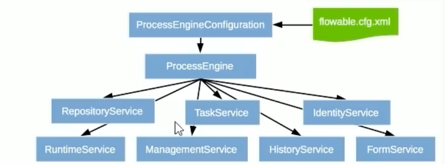
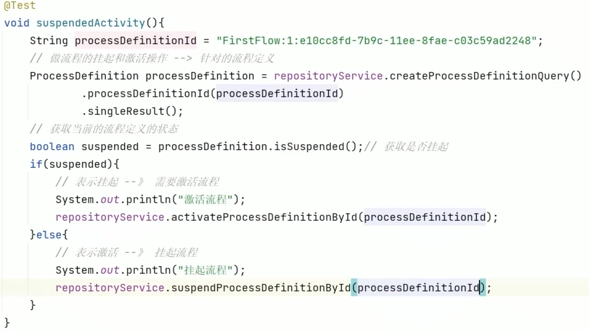
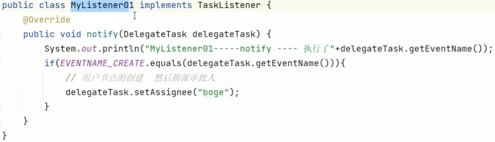

### Flowable

Flowable是BPMN2.0协议的一种Java版本的实现，是一个使用Java编写的轻量级业务流程引擎。

### 流程设计引擎

身份管理

**流程绘制**

​	配置审核人、指定流程 id

流程定义：java 中的类

流程实例：java 中的对象	

**结合java springboot** **简单流程部署**

```sql
## 初始化后数据库表
act_re_deploy   部署任务

act_ru_task     运行时任务 当前待办的任务

act_hi_procinst  历史流程实例 每启动 一个流程实例就会在表中维护一条记录
act_ru_execution 记录流程的分支
```

```java
// 项目部署
Deployment deploy = repositoryService.createDepolyment()
  .addClassPathResource("")
  .name()
  .deploy();
// 任务执行
runtimeService.startProcessInstanceById(processId);
runtimeService.startProcessInstanceByKey(processKey);
//用户查询待办信息
processEngine.getTaskService();
List<Task> list = taskService.createTaskQuery()
  .taskAssignee("xxx")
  .list()
  
// 用户审批处理 传入 taskId
taskService.complete(taskId:)
```



Re：仓库 资源类

Ru：运行时类

Hi：历史数据

Ge：通用

ID： 用户身份信息

**流程的挂起和激活**



```java
// 流程定义

// 流程实例
runtimeService.suspendProcessInstanceById(taskId)
```

问题：运行中的流程定义 被 挂起了会发生什么？ 已经运行的流程实例不受影响

已经运行中的流程实例不受影响

```
act_hi_actionst 审批详细记录表
act_hi_identity 
act_hi_procinst  流程实例
act_hi_taskinst	 任务实例（节点） 更加详细
```


**通过表达式指定审批用户** ，确保灵活性

```java
// 值表达式
${assign1}
// 在启动流程实例的时候就可以绑定表达式的值
Map<String,Object> var = new HashMap<>();
var.put("assign1","lisi")；
taskService.complete(taskId:,var)；
  
 // 方法表达式
 // ${MyBean.assign}
  
@Component
public void myBean{
  public String getAssign(){
    return "wangwu"
  }
}

taskService.complete(taskId:,var)；
```


**注册监听器** 监听器分配




全局变量

```java
// 值表达式
${assign1}
// 在启动流程实例的时候就可以绑定表达式的值
Map<String,Object> var = new HashMap<>();
// var.put("assign1","lisi");
// 启动阶段存的变量  为全局变量
var.put("var1","test1");
var.put("var2","test2");
var.put("var3","test3");
runtimeService.startProcessByinstanceId(taskId:,var);


// 获取变量
runtimeService.setVariable(id,k,v);
// 设置局部变量控制流程分支、网关、审批人
runtimeService.setVariableLocal(id,kLocal,vLocal);
taskService
// 设置变量
map<string , Object> var = runtimeService.getVariable(exeutionid);
taskService.getVariable(taskid)
```


**网关**

- **互斥网关（Exclusive Gateway）** ，又称排他网关，他有且仅有一个有效出口，可以理解为if......else if...... else if......else，就和我们平时写代码的一样。
- **并行网关（Parallel Gateway）** ，他的所有出口都会被执行，可以理解为开多线程同时执行多个任务。
- **包容性网关（Inclusive Gateway）** ，只要满足条件的出口都会执行，可以理解为 if(......) do, if (......) do, if (......) do，所有的条件判断都是同级别的。


例子

假设公司产品有一个新需求，需要你设计一个员工请假流程的功能。你该如何设计？

1. 我会用flowable来实现
2. 创建springboot项目（flowable-ui），该项目是启动flowable-ui网站，在本地进行流程画图设计。安装flowable-ui，启动服务进入folwable-ui网站画图，导出图对应的xml文件 (画图)
3. 创建springboot项目（flowable），该项目是启动流程应用，将对应的xml文件复制到resources下的processes文件夹中(processes文件夹需自己创建) (部署)
4. 启动springboot项目 (启动)
5. 通过接口调用，启动流程 (流转)

设计企业入驻审批

1. 园区一线人员 收集企业入驻必要信息

   1. 企业信息 比方说 入驻  **位置**  入驻**面积** 入驻**周期** 
      2. *一线人员可以暂存 撤回 废除 不涉及审批流程

   - 操作：暂存
     - 数据不会进入审批流，仅保存至自定义的业务表。
   - 操作：提交
     - `ACT_RU_TASK` 表新增一条任务记录（任务类型为用户任务）。
     - `ACT_RU_EXECUTION` 表新增一条流程实例记录。
     - 流程变量（如位置、面积、周期）存储到 `ACT_RU_VARIABLE` 表中

2. 提交给入驻园区负责人 审批该合同 

   1. 材料通过  审核状态改变为 
   2. 是否需要修改  
      1. 面积超出剩余使用面积，会出现提示
      2. 入驻位置已被占用
      3. 入驻周期少于 1 年也会
   3. 是否废除
   4. 暂存 不涉及审批流程

   - - 当前任务状态从 `ACT_RU_TASK` 表移至 `ACT_HI_TASKINST` 表。
     - 流程实例继续执行，生成下一任务节点的记录。
   - 操作：修改
     - 流程变量（如位置、面积）更新到 `ACT_RU_VARIABLE` 表中。
   - 操作：废除
     - 流程结束，实例记录从 `ACT_RU_EXECUTION` 表移至 `ACT_HI_PROCINST` 表。

3. 园区一线人员审核

   1. 根据合同金额、占用面积、不同位置 生成多级审批流
   2. 金额大于某个自定义的数，比如说 超过100w 时 需要走两级审批

   - 操作：两级审批
     - 根据金额条件动态生成两级审批任务，`ACT_RU_TASK` 表中生成两条任务记录。
   - 操作：单级审批
     - 只生成一条任务记录。

4. 最后提交 OA 系统，国投原始系统自带的 api

   1. 测试通过调用系统接口

   - 流程结束，所有运行时表（如 `ACT_RU_TASK` 和 `ACT_RU_EXECUTION`）记录转移至历史表。
   - 接口返回结果记录到 `ACT_HI_VARINST` 表中，存储 OA 系统的响应信息
