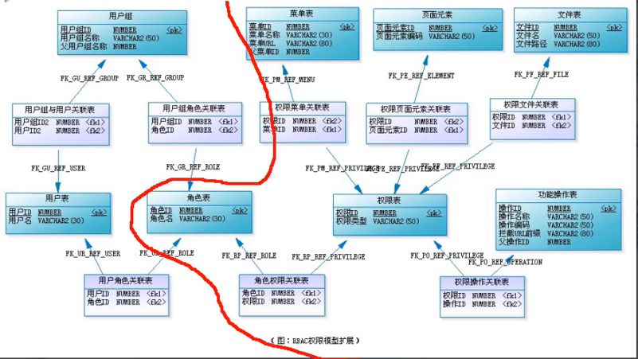

#### 个人面试100题

##### java

浅拷贝

指的是复制对象时，只复制对象本身和它的基本类型字段（如 `int`、`char` 等）。对于引用类型字段（如数组、对象等），浅拷贝只是复制引用，即两个对象的引用类型字段会指向同一个**内存地址**（即引用共享同一块内存区域）

深拷贝

深拷贝指的是复制对象时，不仅复制对象本身，还会递归地复制所有引用类型字段，创建它们的副本。因此，深拷贝创建的新对象和原对象完全独立，它们的引用类型字段指向不同的内存位置，互不影响

##### **Java集合**

1. java HashMap底层

   - 基于哈希表的数据结构，用于存储键值对，通过哈希值来映射到数组的索引位置，通过数组➕链表来处理哈希冲突
   - 当链表长度**超过8**之后，会使用红黑树来代替链表，形成数组➕红黑树的结构来处理哈希冲突，红黑树是一种自平衡二叉树，能够将最坏情况时间复杂度从O(n)降低为O(Logn)
   - 性能提升 通过修改负载因子等方法
   - 哈希冲突 链地址法
   
2. java HashSet

   java中HashSet的底层实现是HashMap，HashSet只考虑key的值，value都指向同一个全局object常量，这样就实现了HashSet。 比较过程： 1.通过哈希算法比较哈希值 2.哈希值相等再比较equals 

---

##### **Java 多线程**

1. volatile关键字作用
   - 保证线程可见性 当字段被修改时，立即更新
   - 防止指令重排序（代码重排序）
2. 死锁

---

**JVM**

1. 类的生命周期

加载（Loading）、验证（Verification）、准备（Preparation）、解析（Resolution）、初始化（Initialization）、使用（Using）和卸载（Unloading）

以下是Java类生命周期中的**加载**阶段的简要说明：

1. **加载（Loading）**：JVM通过类加载器（`ClassLoader`）将Java字节码文件（`.class`文件）从存储位置（如文件系统或网络）读取到内存中，形成一个字节码数据的二进制流。
2. **链接（Linking）**：包含三个子阶段：
   - **验证（Verification）**：检查字节码的合法性，确保其符合Java语言规范，以防止非法代码破坏系统。
   - **准备（Preparation）**：为类的静态变量分配内存，并将其初始化为默认值。
   - **解析（Resolution）**：将符号引用转换为直接引用，建立类与类之间的关联关系。
3. **初始化（Initialization）**：为静态变量赋予用户定义的初始值，并执行类中的静态初始化块和静态变量的赋值操作。

真正将Java字节码转换为机器代码的步骤发生在**解释和即时编译（JIT）**阶段，而这不是类加载阶段的一部分

2. 类加载过程

加载 -> 连接 -> 初始化->使用->卸载

连接

验证-> 准备->解析

3. 类加载器作用

加载java类的字节码到jvm中

4. 类加载器有哪些

启动类加载 **`BootstrapClassLoader`**

扩展类加载器皿**`ExtensionClassLoader`**

**应用程序类加载器****`AppClassLoader`**

5. 双亲委派机制

`ClassLoader` 类使用委托模型来搜索类和资源。每个 `ClassLoader` 实例都有一个相关的父类加载器。需要查找类或资源时，`ClassLoader` 实例会在试图亲自查找类或资源之前，将搜索类或资源的任务委托给其父类加载器。
 虚拟机中被称为 "bootstrap class loader"的内置类加载器本身没有父类加载器，但是可以作为 `ClassLoader` 实例的父类加载器

6. 二进制流的优势

   将`.class`文件加载成**二进制流**是因为这种形式最适合JVM的执行需求和操作机制。具体原因如下：

   ---

   ### 1. **适配字节码的格式和结构**
      - `.class`文件以二进制编码的形式存储了**Java字节码**，其中包含类的各种定义（方法、字段、常量池、访问权限等）。
      - JVM在加载时可以直接按照二进制格式逐步读取和解析字节码结构，而不需要额外的转换步骤，保证了读取的**高效性**和**一致性**。
      - 其他格式（如文本格式）会带来额外的解析开销，同时容易引入兼容性问题。

   ---

   ### 2. **便于跨平台使用**
      - 二进制流是一种与平台无关的通用表示。Java字节码的设计目标之一是跨平台，确保可以在不同的操作系统和硬件上执行。
      - 二进制格式确保了`.class`文件的**可移植性**和**一致性**，在不同平台上通过相同的结构定义加载和解释，JVM只需要针对目标平台的指令集生成机器代码即可。

   ---

   ### 3. **提高加载速度和内存效率**
      - 将`.class`文件内容转为二进制流后，数据可以被**顺序读取**并直接加载到内存中，减少了文件读取和格式转换的时间开销。
      - 使用二进制流表示数据的大小固定，便于JVM在加载时直接定位特定的内容（如常量池、字段表），有效提升了**内存管理**和**数据访问**的效率。

   ---

   ### 4. **便于运行时优化和即时编译（JIT）**
      - 在二进制流状态下，JVM可以根据需要对字节码进行**优化**或**即时编译**，而不需要额外的解析或转换步骤。
      - 二进制形式的数据也易于在JVM内部进行转换，直接传给JIT编译器生成机器码，这样的处理效率较高。

   ---

   ### 5. **支持多种来源和加载方式**
      - 由于JVM的二进制流是抽象的加载形式，类加载器可以从多种数据源（磁盘、网络、内存）获取二进制流，扩展了加载的灵活性。
      - 无论是文件、网络、还是动态生成的字节码，只要它们能够提供符合JVM规范的二进制流，就可以被JVM统一加载和解析。

   ---

   ### 6. **安全性和完整性**
      - 二进制流加载使得JVM可以在**验证**阶段对字节码的结构和指令进行安全检查，以确保加载的类符合Java语言规范，防止恶意字节码执行。
      - 如果使用其他不定长或非固定格式的数据，验证的效率和安全性会降低。

   ---

   ### **总结**
   二进制流作为固定的、平台无关的、内存友好的表示形式，最适合Java字节码的加载需求。它保证了JVM的加载、解析、执行效率和跨平台兼容性，同时支持灵活的类加载机制。

8. JVM内存区域

堆 新生代 老年代 

方法区 元空间

栈 每个线程都有一个独立的栈

---

##### **设计模式** 

设计模式是**可复用的解决方案**，用于解决在软件开发过程中常见的设计问题，以提高代码的**可维护性、可扩展性和灵活性**

1. 单例模式：

   - 确保类只有一个实例，提供一个全局访问点，例如Windows任务管理器
   - 2种实现模式、饿汉模式，在类加载时就进行实例化、本身就安全;通过 ‘ a.getInstance()’调用
   - 懒汉模式 调用时才进行实例化、效率高于饿汉模式 判断是否为空

2. 装饰模式和代理模式
   **装饰模式**在不改变原始类接口的情况下，对原始类功能进行增强，并且支持多个装饰器的嵌套使用。主要是对原始类功能进行增强，支持多个装饰器的嵌套使用

   **代理模式**在不改变原始类接口的条件下，为原始类定义一个代理类，主要目的是控制访问，而非加强功能**，这是它跟装饰器模式最大的不同。**主要增强的是非主干或者说非业务性的功能

3. 委派模式和策略模式

   老板（Boss）给项目经理（Leader）下达任务，项目经理会根据实际情况给每个员工派发工作任务，待员工把工作任务完成之后，再由项目经理汇报工作进度和结果给老板

   只负责任务的调度和分配任务，跟代理模式很像，可以看做是一种特殊情况下的静态代理的全权代理，但是代理模式注重过程，而委派模式注重结果。

----

##### **计算机网络**

6. http状态码

   **1XX** Infommational(信息性状态码)   接收的请求正在处理
   **2XX**Success(成功状态码)                   请求正常处理完毕
   **3XX** Redirection(重定向状态码)         **需要进行附加操作以完成请求**
   **4XX** Client Error(客户端错误状态码)  服务器无法处理请求
   **5xx** Server Eror(服务器错误状态码)  服务器处理请求出错

7. http header

   **请求部分**

   accept 能够接受的回应内容类型

   accept-charset

   accept-lauguage

   accept-Encoding

   Authorization 授权信息

   Cache-Control 用来指定在这次的请求/响应链中的所有缓存机制 都必须 遵守的指令

   **响应部分**

   Connection 该浏览器想要优先使用的连接类型

   Content

   Content-Length 以八位字节数组（8 位的字节）表示的**请求体**的长度

   Content-MD5 请求体的内容的二进制 MD5 散列值，以 Base64 编码的结果

   Content-Type 请求体的多媒体类型（用于 POST 和 PUT 请求中）

   Cookie  之前由服务器通过 Set-Cookie（下文详述）发送的一个超文本传输协议 Cookie

   Date 发送该消息的日期和时间

   From 发起此请求的用户的邮件地址

   **Server**: 包含服务器的应用程序信息。

   **Location**: 用于重定向请求时的目标 URL

   **Access-Control-Allow-Origin**: 指定允许跨域访问的来源

8. get post请求

   语义（主要区别）：GET 通常用于获取或查询资源，而 POST 通常用于创建或修改资源。

   幂等：GET 请求是幂等的，即多次重复执行不会改变资源的状态，而 POST 请求是不幂等的，即每次执行可能会产生不同的结果或影响资源的状态。

   格式：GET 请求的参数通常放在 URL 中，形成查询字符串（querystring），而 POST 请求的参数通常放在请求体（body）中，可以有多种编码格式，如 application/x-www-form-urlencoded、multipart/form-data、application/json 等。GET 请求的 URL 长度受到浏览器和服务器的限制，而 POST 请求的 body 大小则没有明确的限制。不过，实际上 GET 请求也可以用 body 传输数据，只是并不推荐这样做，因为这样可能会导致一些兼容性或者语义上的问题。

   缓存：由于 GET 请求是幂等的，它可以被浏览器或其他中间节点（如代理、网关）缓存起来，以提高性能和效率。而 POST 请求则不适合被缓存，因为它可能有副作用，每次执行可能需要实时的响应。

   安全性：GET 请求和 POST 请求如果使用 HTTP 协议的话，那都不安全，因为 HTTP 协议本身是明文传输的，必须使用 HTTPS 协议来加密传输数据。另外，GET 请求相比 POST 请求更容易泄露敏感数据，因为 GET 请求的参数通常放在 URL 中。

9. 三次握手 四次挥手

   - **一次握手**:客户端发送带有 SYN（SEQ=x） 标志的数据包 -> 服务端，然后客户端进入 **SYN_SEND** 状态，等待服务端的确认；
   - **二次握手**:服务端发送带有 SYN+ACK(SEQ=y,ACK=x+1) 标志的数据包 –> 客户端,然后服务端进入 **SYN_RECV** 状态；
   - **三次握手**:客户端发送带有 ACK(ACK=y+1) 标志的数据包 –> 服务端，然后客户端和服务端都进入**ESTABLISHED** 状态，完成 TCP 三次握手。

   当建立了 3 次握手之后，客户端和服务端就可以传输数据啦！

10. **第一次挥手**：客户端发送一个 FIN（SEQ=x） 标志的数据包->服务端，用来关闭客户端到服务端的数据传送。然后客户端进入 **FIN-WAIT-1** 状态。

    **第二次挥手**：服务端收到这个 FIN（SEQ=X） 标志的数据包，它发送一个 ACK （ACK=x+1）标志的数据包->客户端 。然后服务端进入 **CLOSE-WAIT** 状态，客户端进入 **FIN-WAIT-2** 状态。

    **第三次挥手**：服务端发送一个 FIN (SEQ=y)标志的数据包->客户端，请求关闭连接，然后服务端进入 **LAST-ACK** 状态。

    **第四次挥手**：客户端发送 ACK (ACK=y+1)标志的数据包->服务端，然后客户端进入**TIME-WAIT**状态，服务端在收到 ACK (ACK=y+1)标志的数据包后进入 CLOSE 状态。此时如果客户端等待 **2MSL** 后依然没有收到回复，就证明服务端已正常关闭，随后客户端也可以关闭连接了。

---

##### 操作系统

1. 有了进程为什么还需要线程

   进程切换开销大于线程

   线程更加轻量，一个进程可以创建多个线程

   **多个线程可以并发处理不同的任务，更有效地利用了多处理器和多核计算机。**而进程只能在一个时间干一件事，如果在执行过程中遇到阻塞问题比如 IO 阻塞就会挂起直到结果返回。

   **同一进程内的线程共享内存和文件，因此它们之间相互通信无须调用内核**
   
2. 线程如何进行数据通信

   共享内存

   信号量

   互斥锁

3. 死锁  **A在占有资源1的同时需要资源2 ，B在占有资源2的同事需要资源1**

   四个必要条件 **1. 互斥条件 2. 占有和等待 3. 不可抢占 4. 循环等待**

   解决方法 **银行家算法 请求某资源时，先试探释放资源，判断该方法是否安全**

4. 进程有几种状态

   1. 创建 new-> 就绪 ready ->运行->阻塞->结束

5. 学一下Go语言

6. CPU寻址

   央处理单元（CPU）通过**内存地址来访问计算机系统中的数据或指令的过程**。简单来说，寻址就是 CPU **如何定位**存储在内存中的数据、指令或其他资源的位置

7. 调度算法

   1. 虚拟内存调度算法
      1. FIFO
      2. LRU
      3. LFU
      4. OPT

   2. 进程调度算法
      1. FCFS
      2. SJF
      3. RR 时间片


----

##### SpringBoot

1. 循环依赖 两个bean互相依赖 三个依赖 三角依赖的关系都会构成循环依赖

   - 加入二级缓存 并利用java的引用传递，

     创建A

     ​	空的A加入缓存， **提前暴露**

     ​	调用b时，b还没有被创建，

     ​	创建b，创建b需要A，

     ​			从缓存中获取A并赋值，

     ​	b创建成功，

     A也创建成功

   - 三级缓存 应对AOP情况 **提前AOP**

   - 实际业务开发很少出现情况，通过**分层设计**，每一层负责特定的功能，例如表现层（控制层），业务层，持久层，只允许更高层调用更底层代码，确保系统各个部分的代码逻辑是单向的，避免了循环依赖

2. **IOC 控制反转** 将对象之间的依赖关系交给IOC容器管理，本质是一个Map对象

   IoC 容器就像是一个工厂一样，当我们需要创建一个对象的时候，只需要配置好配置文件/注解即可，完全不用考虑对象是如何被创建出来的。

3. AOP

   旨在将跨越多个模块或类的**通用功能**（如日志记录、权限控制、事务管理等）进行分离，减少代码重复，并保持核心业务逻辑的简洁性。

4. SpringBoot 和Spring MVC的区别

   1. Spring MVC 是基于Spring的一个 **MVC 框架**；
   2. Spring Boot 是基于Spring4的条件注册的一套**快速开发整合包。** 它集成了**大量常用的第三方库配置(例如Jackson, JDBC, Mongo, Redis, Mail**等等)
   
5. spring 运行机制

   1. 利用DI和AOP实现


---

##### **Mysql**

1. mysql最大存储限制

   每行的最大大小为 **16KB**，但可以通过溢出页存储大字段（如 `BLOB` 或 `TEXT`）来突破此限制。

2. 存储引擎

   - innoDB  支持事务
   - MyISAM

3. innoDB与MyISAM的区别 实际应用中几乎不存在使用MyISAM的理由了

   1. 是否支持**行级锁**
   2. 是否支持事务
   3. 是否支持外键 但都不推荐使用
   4. 是否支持数据库异常崩溃后的安全恢复
   5. 是否支持 MVCC
   6. 索引实现不一样
   7. **性能有差别**
   8. 数据缓存策略和机制实现不同
   9. 索引存储方式的不同 innoDB放在一起，MyISAM分开放

4. 锁

   1. 行级锁 锁粒度小，并发度高 开销大
   2. 表级锁  对当前操作的整张表加锁，实现简单，资源消耗也比较少，加锁快

5. 事务是什么？ 结合场景

   **事务是逻辑上的一组操作，要么都执行，要么都不执行**

   例子就是**转账**了。假如小明要给小红转账 1000 元，这个转账会涉及到两个关键操作，这两个操作必须都成功或者都失败。

   1. 将小明的余额减少 1000 元
   2. 将小红的余额增加 1000 元。

6. ACID原则

   A 原子性 要么全部成功 要么全部失败

   C 一致性 数据完整性规则不被破坏

   I **隔离性** 并发访问数据库时，一个用户的事务不被其他事务所干扰，各并发事务之间数据库是独立的

   D 持久性

7. 并发事务 带来的问题

   1. 脏读
   2. 丢失修改 
   3. 不可重复读 
   4. 幻读 不可重复读的一种特殊情况

8. 解决方法

   1. 不可重复读 加锁
   2. 幻读，由于加锁只能锁住已有的数据 例如delete和update时，对记录加锁，保证事务的安全，而insert操作产生新的数据，所以是一种特殊情况，需要通过增加**间隙锁**来保证不出现幻读的情况

9. **隔离**级别

   |        隔离级别         | 脏读 | 不可重复读 | 幻读 |
   | :---------------------: | :--: | :--------: | :--: |
   |    READ-UNCOMMITTED     |  √   |     √      |  √   |
   |     READ-COMMITTED      |  ×   |     √      |  √   |
   | REPEATABLE-READ（默认） |  ×   |     ×      |  √   |
   |      SERIALIZABLE       |  ×   |     ×      |  ×   |

10. Mysql性能优化有哪些方式

    1. 优化sql语句
    2. 索引优化
    3. 分库分表

11. Mysql 规范

    1. https://javaguide.cn/database/mysql/mysql-high-performance-optimization-specification-recommendations.html

12. 谈谈你是如何优化sql查询速度的

    1. **找到瓶颈 **利用性能监控工具定位慢sql，**MySQL 慢查询日志**、**Performance Schema** 

    2. **索引优化** 、表结构优化、sql语句的优化

    3. 架构优化

       1. **读写分离**

       将读操作和写操作分离到不同的数据库实例，提升数据库的并发处理能力。

       2. **分库分表**

       将数据分散到多个数据库实例或数据表中，降低单表数据量，提升查询效率。但要权衡其带来的复杂性和维护成本，谨慎使用。

       3. **缓存机制 redis等等**

       4. **数据库冷热分离** 其引入的复杂性会带来额外的维护成本

       根据数据的访问频率和业务重要性，将数据分为冷数据和热数据，冷数据一般存储在存储在低成本、低性能的介质中，热数据高性能存储介质中。

13. 什么是索引

    是一种用于快速查询和检索数据的数据结构，其本质可以看成是一**种排序好的数据结构**

14. 索引优缺点

    - 使用索引可以大大加快数据的检索速度（大大减少检索的数据量）, 减少 IO 次数，这也是创建索引的最主要的原因。

    - 通过创建唯一性索引，可以保证数据库表中每一行数据的唯一性。
    - 缺点
      - **创建索引和维护索引需要耗费许多时间**。当对表中的数据进行增删改的时候，如果数据有索引，那么索引也需要动态的修改，会降低 SQL 执行效率。
      - 索引需要使用物理文件存储，也会耗费一定空间

15. 索引底层数据结构 **默认使用B+树**

    1. hash表

    2. 二叉查找树BST

    3. 自平衡树 AVL

    4. 红黑树

    5. B&B+树

       B+Tree 中，**所有数据都集中在叶子节点**，这样不仅可以提高查询效率，还能更好地支持范围查询

16. B 树& B+树两者有何异同呢？

    - B 树的所有节点既存放键(key) 也存放数据(data)，而 **B+树只有叶子节点存放 key 和 data，其他内节点只存放 key**。
    - **B 树的叶子节点都是独立的;B+树的叶子节点有一条引用链指向与它相邻的叶子节点。**
    - B 树的检索的过程相当于对范围内的每个节点的关键字做二分查找，可能还没有到达叶子节点，检索就结束了**。而 B+树的检索效率就很稳定了，任何查找都是从根节点到叶子节点的过程，叶子节点的顺序检索很明显。**
    - 在 B 树中进行范围查询时，首先找到要查找的下限，然后对 B 树进行中序遍历，直到找到查找的上限；而 B+树的范围查询，只需要对链表进行遍历即可。

    综上，B+树与 B 树相比，具备更少的 IO 次数、更稳定的查询效率和更适于范围查询这些优势。

17. 索引分类

    1. 数据结构 同上**底层结构部分**

    2. 按照底层存储方式

       1. 聚簇索引（聚集索引）：**索引结构和数据一起存放的索引**，InnoDB 中的主键索引就属于聚簇索引。 
       2. 非聚簇索引（非聚集索引）：索引结构和数据分开存放的索引，二级索引(辅助索引)就属于非聚簇索引。MySQL 的 MyISAM 引擎，不管主键还是非主键，使用的都是非聚簇索引。

    3. 按照使用方式

       主键索引：加速查询 + 列值唯一（不可以有 NULL）+ 表中只有一个。

       普通索引：仅加速查询。

       唯一索引：加速查询 + 列值唯一（可以有 NULL）。

       覆盖索引：一个索引包含（或者说覆盖）所有需要查询的字段的值。

       联合索引：多列值组成一个索引，专门用于组合搜索，其效率大于索引合并。

       全文索引：对文本的内容进行分词，进行搜索。目前只有 `CHAR`、`VARCHAR` ，`TEXT` 列上可以创建全文索引。一般不会使用，效率较低，通常使用搜索引擎如 ElasticSearch 代替。

18. 什么是主键索引

    1. 当表中没有显示指定主键时，会寻找不为null且唯一的列作为主键，如果没有，则会创建一个6btye的自增主键

19. 什么是二级索引

    1. 唯一索引，普通索引，前缀索引等索引都属于二级索引。

20. 聚簇索引的的优缺点

    优点

    1. 查询速度快
    2. 对排序和范围查找速度非常快

    缺点

    	1. 依赖于有序的数据
    	1. 更新代价较大

21. MySql索引失效

    1. 使用select *  ，可能会导致索引失效，无法使用覆盖索引等等
    2. 创建组合索引，但查询条件未遵守最左匹配原则
    3. 在索引列上进行计算、函数、类型转换等操作
    4. 以 % 开头的 LIKE 查询比如 `LIKE '%abc';`
    5. 查询条件中使用 OR，且 OR 的前后条件中有一个列没有索引，涉及的索引都不会被使用到;
    6. IN 的取值范围较大时会导致索引失效，走全表扫描(NOT IN 和 IN 的失效场景相同)

22. 如何分析sql语句是否走了索引查询

    1. 使用explain分析
    2. 根据explain输出结果，观察type类型、key


----

##### **Redis  Remote dictionary Server 远程字典服务**

    与传统数据库不同的是，Redis 的数据是保存在内存中的（内存数据库，支持持久化），因此读写速度非常快，被广泛应用于分布式缓存方向。并且，Redis 存储的是 KV 键值对数据

1. Redis为什么这么快 ，redis的优势是什么
   1. Redis **基于内存**，内存的访问速度比磁盘快很多
   1. Redis 内置了多种优化过后的数据类型/结构实现，性能非常高
   1. Redis 通信协议实现简单且解析高效
   1. Redis 基于 Reactor 模式设计开发了一套高效的事件处理模型，主要是单线程事件循环和 IO 多路复用（Redis 线程模式后面会详细介绍到）
   1. 支持高并发
   1. 功能全面 分布式锁、限流、消息队列、延迟对列等场景
   
2. 除了redis，你还知道别的缓存服务吗

   1. [Dragonfly](https://github.com/dragonflydb/dragonfly)： **龙飞** 一种针对现代应用程序负荷需求而构建的内存数据库，完全兼容 Redis 和 Memcached 的 API，迁移时无需修改任何代码，号称**全世界最快的内存数据**库。
   2. [KeyDB](https://github.com/Snapchat/KeyDB)： Redis 的一个**高性能分支**，专注于**多线程、内存效率**和高吞吐量。
   3. **Memcached**
   4. Tendis 

3. redis和Memcached的异同点

   **数据类型**：Redis 支持**更丰富的数据类型**（支持更复杂的应用场景）。Redis 不仅仅支持简单的 k/v 类型的数据，同时还提供 list，set，zset，hash 等数据结构的存储。Memcached 只支持最简单的 k/v 数据类型。

   **数据持久化**：Redis 支持**数据的持久化，可以将内存中的数据保持在磁盘中，重启的时候可以再次加载进行使用**，而 Memcached 把数据全部存在内存之中。也就是说，Redis 有**灾难恢复机制**而 Memcached 没有。

   **集群模式支持**：Memcached 没有原生的集群模式，需要依靠客户端来实现往集群中分片写入数据；但是 Redis 自 3.0 版本起是原生支持集群模式的。

   **线程模型**：Memcached 是多线程，非阻塞 IO 复用的网络模型；Redis 使用单线程的多路 IO 复用模型。 （Redis 6.0 针对网络数据的读写引入了多线程）

   **特性支持**：**Redis 支持发布订阅模型、Lua 脚本、事务等功能**，而 Memcached 不支持。并且，Redis 支持更多的编程语言。

   **过期数据删除**：Memcached 过期数据的删除策略只用了**惰性删除**，而 Redis 同时使用了惰性删除与定期删除。

4. redis常见的数据类型

   **5 种基础数据类型**：String（字符串）、List（列表）、Set（集合）、Hash（散列）、Zset（有序集合）。

   **3 种特殊数据类型**：HyperLogLog（基数统计）、Bitmap （位图）、Geospatial (地理位置)。

5. Hash和String存储对象更好

   1. **对象存储方式**：String 存储的是序列化后的对象数据，存放的是**整个对象，操作简单直接**。Hash 是对对象的每个字段单独存储，可以获取部分字段的信息，也可以修改或者添加部分字段，节省网络流量。如果对象中某些字段需要经常变动或者经常需要单独查询对象中的个别字段信息，Hash 就非常适合。

      **内存消耗**：Hash 通常比 String 更节省内存，特别是在字段较多且字段长度较短时。Redis 对小型 Hash 进行优化（如使用 ziplist 存储），进一步降低内存占用。

      **复杂对象存储**：String 在处理多层嵌套或复杂结构的对象时更方便，因为无需处理每个字段的独立存储和操作。

      **性能**：String 的操作通常具有 O(1) 的时间复杂度，因为它存储的是整个对象，操作简单直接，整体读写的性能较好。Hash 由于需要处理多个字段的增删改查操作，在字段较多且经常变动的情况下，可能会带来额外的性能开销。

   **总结**

   1. 在绝大多数情况下，**String** 更适合存储对象数据，尤其是当对象结构简单且整体读写是主要操作时。
   2. 如果你需要频繁操作对象的部分字段或节省内存，**Hash** 可能是更好的选择。

6. 类似购物车信息的数据 使用hash还是string

   1. hash

   2. 用户添加商品就是往 Hash 里面增加新的 field 与 value；

      查询购物车信息就是遍历对应的 Hash；

      更改商品数量直接修改对应的 value 值（直接 set 或者做运算皆可）；

      删除商品就是删除 Hash 中对应的 field；

      清空购物车直接删除对应的 key 即可

7. redis排行榜

   1. 有序集合

8. Set的应用场景

   1. `Set` 的常见应用场景如下：
      - 存放的数据不能重复的场景：网站 UV 统计（数据量巨大的场景还是 `HyperLogLog`更适合一些）、文章点赞、动态点赞等等。
      - 需要获取多个数据源交集、并集和差集的场景：共同好友(交集)、共同粉丝(交集)、共同关注(交集)、好友推荐（差集）、音乐推荐（差集）、订阅号推荐（差集+交集） 等等。
      - 需要随机获取数据源中的元素的场景：抽奖系统、随机点名等等。

9. Set设置抽奖系统

##### Linux

常用的**性能分析工具** top(cpu)、free(内存)、df(磁盘)、dstat(网络流量)、pstack、vmstat、strace(底层系统调用)

- TOP（cpu） ps htop 查看cpu使用情况
- free -m  内存
- df -m /path
-   dstat -c  cpu 情况   -d 磁盘读写     -n 网络状况     -l 显示系统负载     -m 显示形同内存状况     -p 显示系统进程信息     -r 显示系统 IO 情况
- 查询进程状态 ps -ef | grep ../

#### 园区管理系统

项目定制的，给甲方客户开发的一个项目，包括后台和小程序的开发，上线后不负责维护和迭代 

项目的主要功能 园区资产管理 招商模块 运营模块 财务模块 以及企业设备管理

首先，在数据库方面，我现在是真正地体会到数据库的设计真的是一个程序或软件设计的重要和根基。因为数据库怎么设计，直接影响到一个程序或软件的功能的实现方法、性能和维护。由于我做的模块是要对数据库的数据进行计算和操作的，所以我对数据库的设计对程序的影响是深有体会，就是因为我们的数据库设计得不好，搞得我在对数据库中的数据进行获取和计算利润、总金时，非常困难，而且运行效率低，时间和空间的复杂也高，而且**维护起来很困难，**过了不久，即使自己有注释，但是也要认真地看自己的代码才能明白自己当初的想法和做法。加上师兄的解说，让我对数据库的重要的认识更深一层，数据库的设计真的是重中之重。

**合同金额账单的设计 设计租金保证金 减免 违约金**


## YUPI刷题

1. 面向对象

3. JAVA内存管理

   1. **堆** 用于动态的分配对象 内存不受限制 通过垃圾回收机制释放
   2. **栈** 适用于局部变量和方法调用 内存有限 但速度快 自动释放
   3. **垃圾回收机制 **  一种内存管理机制 回收不再被使用的对象或内存资源 
      1. 年轻代 **复制算法**
      2. 老年代 **标记-整理算法**

4. I/O 机制

   1. 字符流 FileReader文本数据Unicode  字节流 FileInputStream 处理字节数据
   2. I/O 模型
      1. BIO
      2. NIO
      3. IO多路复用

5. 多线程

   1. 线程生命周期

      **新建（New）**、**就绪（Runnable）**、**运行（Running）**、**阻塞/等待（Blocked/Waiting）** 和 **终止（Terminated）**

      ```
      New --> Runnable <--> Running --> Terminated
                ↑↓           ↑↓
                 Blocked/Waiting
      ```

      - **New → Runnable**: 调用 `start()` 方法。
      - **Runnable → Running**: 获取 CPU 时间片。
      - **Running → Runnable**: 线程被抢占或调用 `yield()` 方法。
      - **Running → Blocked/Waiting**: 线程等待锁或调用 `sleep()`、`wait()`。
      - **Blocked/Waiting → Runnable**: 条件满足或被唤醒。
      - **Running → Terminated**: `run()` 方法执行完毕或线程中断。

6. 设计模式

   1. | **分类**       | **分类依据**         | **关注点**                   | **解决问题**                           |
      | -------------- | -------------------- | ---------------------------- | -------------------------------------- |
      | **创建型模式** | 对象如何创建         | 创建对象的方式与逻辑的封装   | 实例化复杂性、对象复用、解耦实例化过程 |
      | **结构型模式** | 对象和类的结构关系   | 组织对象之间的依赖与组合方式 | 类和对象的协作、接口兼容性、代码复用   |
      | **行为型模式** | 对象之间的职责和交互 | 对象间的通信与职责划分       | 职责分配、算法封装、对象解耦           |

   2. 常见模式

      1. 单例模式 确保**一个类**只有**一个实例**，并提供全局访问点 
         1. 多线程情况下 配置管理类
      2. 工厂模式 定义一个接口或抽象类用于创建对象 具体实现交给子类
         1. 实例化逻辑复杂或需要灵活扩展时
      3. 原型模式  通过克隆现有对象创建新对象。
         1. 大量对象创建或复制时性能要求较高
      4. 装饰器模式 动态的为对象添加额外的指责 无需修改原类
      5. 适配器模式 
         1. 系统需要使用现有类而其接口不符合需求时
      6. 策略模式

7. 数组和链表的结构和使用

   1. 使用场景

   数组：

   - **随机访问**：当需要频繁通过索引访问元素时，数组是最佳选择。
   - **静态数据量**：当数据大小已知且不会动态变化时。
   - **高效存储**：连续的内存空间减少了额外开销。

   链表

   - **动态数据量**：数据量经常变化时，链表比数组更合适。
   - **频繁插入/删除**：在中间或两端频繁插入/删除数据时，链表效率更高。
   - **不需要随机访问**：当随机访问不频繁时，链表是合适的选择
   
   2. 常见操作时间复杂度
   
      | 特性              | 数组                     | 链表                           |
      | ----------------- | ------------------------ | ------------------------------ |
      | **存储方式**      | 连续内存空间             | 分散内存，通过指针连接         |
      | **随机访问**      | 支持（O(1)*O*(1)）       | 不支持（O(n)*O*(*n*)）         |
      | **插入/删除效率** | 慢（O(n)*O*(*n*)）       | 快（O(1)*O*(1)，在头部或尾部） |
      | **动态性**        | 大小固定（动态数组除外） | 大小动态调整                   |
      | **内存使用**      | 无额外指针开销           | 每个节点多占用指针空间         |
   
7. HashMap TreeMap LinkedHashMap 区别

   | 特性           | **HashMap**                     | **TreeMap**          | **LinkedHashMap**      |
   | -------------- | ------------------------------- | -------------------- | ---------------------- |
   | **底层结构**   | 哈希表                          | 红黑树               | 哈希表 + 双向链表      |
   | **键值顺序**   | 无序                            | 键的自然顺序或自定义 | 插入顺序或访问顺序     |
   | **时间复杂度** | O(1)*O*(1)，最坏为 O(n)*O*(*n*) | O(log⁡n)*O*(log*n*)   | O(1)*O*(1)             |
   | **允许空键**   | 是                              | 否                   | 是                     |
   | **允许空值**   | 是                              | 是                   | 是                     |
   | **适用场景**   | 快速查找和操作                  | 键按顺序迭代         | 保留插入顺序或访问顺序 |

   2. ***为什么 `ConcurrentHashMap` 是线程安全的**
      1. 细粒度缩 分段锁  整个哈希表被分成多个**Segment**，每个 Segment 是一个独立的锁
      2. 无锁算法 CAS CAS 操作会检查某个内存位置的值是否为预期值，如果是，则更新为新值；否则，重新尝试操作

8. Iterator` 和 `ListIterator 单链表和双向链表 

9. Java 泛型  运行类、接口、方法在运行时操作不特定的类，编译时确定具体的类

   1. 重用性、可读性、可维护性  类型安全，减少运行时类型转换的风险

### JAVA并发

1. JMM Java Memory Model

   1. 核心概念
      1. 共享内存
      2. 共享内存：每个线程有一个私有内存
      3. 线程的通信方式
         1. 直接通信
         2. 间接通信

   2. 两个主要问题
      1. 可见性  volatile修饰变量  synchronized 
      2. 有序性 指令重排序   volatile 防止指令重排序

   3. 我对这块知识了解比较浅薄 ，如果有幸有工作机会的话，希望能在以后的实际工作通过实践中加深印象，
   4. Happens-before原则
      1. Happens-Before 原则是 Java 内存模型（JMM）中定义的一种偏序关系，用于判断在多线程环境下，某一个操作的结果是否对另一个操作可见。简单来说，如果一个操作 "happens-before" 另一个操作，那么第一个操作的结果对第二个操作是可见的，且它们的执行顺序是有保证的
   
2. 线程的创建和管理

   1. Thread
   2. Runable 一个线程被创建后，其中定义的运行内容
   3. Callable 同上 运行有返回值的内容
   4. Future 异步任务处理
   
3. 同步机制

   1. *Synchronized 关键字的使用和底层实现
   2. countdownLatch 等待多个线程完成任务
   3. CyclicBarrier 让多个线程同步到某个屏障点后继续执行
   4. semaphore 用于限流 控制同时访问资源的线程数量

13. BlockingQueue 的使用场景

    - **生产者-消费者模式**：生产者线程将任务或数据放入队列，消费者线程从队列中取出并处理。
    - **任务调度**：实现线程池中的任务管理。
    - **延迟任务**：如使用 `DelayQueue` 实现定时任务。
    - **消息传递**：线程间通信，解耦任务生产与消费。

14. 线程池

    1. 工作原理与优势
       1. 维护一个线程集合和任务队列来工作的
       2. **初始化线程池**：
          - 创建指定数量的线程，存放于线程池中等待任务。
       3. **提交任务**：
          - 外部线程将任务提交到线程池的任务队列中。
       4. **分配线程执行任务**：
          - 空闲线程从任务队列中获取任务并执行；
          - 如果没有空闲线程，新任务会被阻塞或根据策略处理。
       5. **线程复用**：
          - 执行完任务的线程不会被销毁，而是返回到线程池继续等待新任务。
       6. **线程终止**：
          - 当线程池被关闭，所有线程会完成当前任务后终止。

15. 并发问题和解决方案

    1. 死锁
    2. 活锁
       1. 两人同时向左侧让路，结果又撞到一起。
       2. 两人再同时向右侧让路，结果又撞到一起。
       3. 他们不断地互相退让，但始终无法通过。
    3. 饥饿 因为资源分配不公平而长期得不到资源
       1. **高优先级线程占用资源**：
          高优先级线程持续占用资源，低优先级线程被长期忽略。
       2. **过小的任务分配时间片**：
          某些线程因分配时间片过小，始终得不到执行机会。
       3. **独占资源的线程没有释放资源**：
          某线程长期占用某些共享资源，其他线程一直处于等待状态
    4. 如何避免并发问题
       1. 避免共享资源
       2. 设计幂等
       3. 按照一直顺序获取锁
       4. 使用不可变的对象 如final

16. 原子操作和CAS

    1. 不可被中断、不可被分割的操作，即一个操作要么完全执行、要么完全不执行、线程安全

    2. **不可分割性**：操作要么完全执行，要么完全不执行，不能被打断。

    3. **对外可见性**：原子操作的结果对其他线程来说是立即可见的。

    4. **线程安全性**：多个线程同时执行原子操作时，不会出现竞争条件或数据不一致的情况。

    5. CAS 是一种硬件编程

       1. CAS 是一种硬件级别的原子操作，执行时包含以下三个操作步骤：

          1. **比较**：比较某个内存地址的当前值是否等于预期值。
          2. **交换**：如果相等，则将该内存地址的值更新为新值；如果不相等，则什么都不做。
          3. **返回结果**：返回布尔值或旧值，表明操作是否成功。

          这三个步骤在硬件层面上是不可分割的，因此可以保证操作的原子性

       2. 线程安全的计数器

       3. 数据结构 无锁队列、无锁栈

       4. 状态管理 如任务状态切换

       5. 乐观锁 数据库更新操作

17. 并发的设计模式

    1. 生产者-消费者 消息队列、日志处理
       1. 一个或多个线程（生产者）生产数据，并将数据放入共享队列。
       2. 另一个或多个线程（消费者）从队列中取出数据进行处理。
       3. 通过队列协调生产者和消费者，避免直接依赖。
1. 读写锁

### JVM

1. JVM内存结构
   1. 共享区域
      1. 堆 垃圾回收机制
         1. 新生代 复制算法
         2. 老年代 标记-整理/清除 算法
      2. 方法区
         1. 永久代
   2. 私有区域
      1. 虚拟机栈  想象一下 debug
      2. 本地方法栈
         1. 非Java语言实现的方法
      3. 程序计数器 用于记录每个线程当前执行的**字节码指令地址**
   
2. 垃圾回收机制 见jvm堆内存区域
   1. 标记-清理
   2. 标记整理
   3. 复制算法
   4. 分代算法
   5. 强引用、软引用、弱引用、虚引用
      1. 强引用 ， 只有一个对象有强引用 指向他，垃圾回收就不会回收该对象，即使JVM内存不足
      2. 软引用，当内存不足时，垃圾回收会尽量回收这些对象
      3. 弱引用，只有一个对象有强引用 指向他，垃圾回收就会回收该对象，即使JVM内存充足
      4. 虚引用，并不能直接访问引用对象，当被对象被垃圾回收时，能够收到一个通知
   
3. 类加载机制
   1. 类加载过程
      1. 加载  class文件 转换为字节码 并加载到内存当中
      2. 连接  将加载好的类整合到JVM中
         1. 验证 文件格式 、元数据 、字节码、符合引用
         2. 准备 设置初始值
         3. 解析 符号引用 转**换为直接引用  符合引用是间接的 需要解析验证才能得到 访问效率低**
      3. 初始化 **静态变量赋值（默认值）** 执行静态代码快
      4. 使用
      5. 卸载
   2. 双亲委派模型
      1. 双亲委派模型是一种类加载的架构设计，它通过将**类加载的请求交给父加载器**处理，避免了**类加载的重复性和潜在的安全风险**
      2. **类加载请求的委派过程**：
         - 当一个类加载器收到加载某个类的请求时，它并不直接进行类的加载，而是将该请求交给它的父类加载器。
         - 如果父类加载器可以加载该类，则父类加载器负责加载并返回该类。如果父加载器无法加载该类（通常是因为类不在父加载器的加载范围内），则当前加载器才会尝试加载该类。
      3. **加载的顺序**：
         - 父加载器（即上层加载器）首先处理加载请求。
         - 当前加载器只会在父加载器无法加载该类时才会执行加载。
         - 这种委派的过程形成了一个层级结构，确保了类加载过程的有序性和安全性。
   3. 类加载模型
      1. 启动类加载模型  核心库
      2. 扩展类 标准库
      3. 应用类 用户定义的类
      4. 自定义类 
   4. 自定义类加载器的实现方法
      1. 继承classLoader
      2. 重写findClass方法
      3. 作用
         1. 动态加载类
         2. 隔离不同类的加载
         3. 从不同源加载类
         4. 修改或增强类加载的行为
   5. JVM性能调优的基本思路和方法
      1. **定位性能瓶颈**
      2. **分析GC（垃圾回收）日志**
         1. 堆内存设置 优化堆的大小
         2. 调整年轻代和老年代的比例
            1. -XX:NewRatio
            2. -XX:SurvivorRatio
      3. **合理配置JVM参数**
         1. `-Xms`：JVM初始堆内存大小。
         2. `-Xmx`：JVM最大堆内存大小。
         3. `-Xmn`：设置年轻代的大小。
         4. `-XX:MetaspaceSize`：设置Metaspace区的初始大小。
         5. `-XX:MaxMetaspaceSize`：设置Metaspace区的最大大小
      4. **内存管理和垃圾回收优化**
      5. **并发性能调优**
   
4. JAVA字节码

   1. Java源代码和字节码关系
      1. JAVA源代码 即 .java文件，编译器还会对源代码进行检查
      2. 字节码 .class文件 通过源代码编译而来 
         1. 执行过程
            1. 加载字节码 
            2. 解释执行 转化为底层机器指令
            3. JIT 对常用字节码转换为机器码并缓存
         2. 跨平台
         3. 可移植 可优化

5. 内存泄漏

   未能及时释放**不再使用的内存**，导致程序占用的内存不断增多，最终可能导致系统资源**耗尽**

   1. 常见场景
      1. 未关闭资源 数据库资源、文件资源
      2. 集合类的对象为及时移除
      3. 静态字段
      4. threadLocal内存泄漏
      5. 缓存

### 计算机网络

1. 五层模型 
   1. 应用层 为用户提供与网络进行交互请求的入口 HTTP https
   2. 传输层 为端到端的通信提供可靠性、流量控制、差错检测等，负责分段和组装数据 TCP提供可靠的连接（网页、下载文件），UDP提供不可靠的无连接（音视频）
   3. 网络层 ICMP IP协议 负责在不同网络之间传输数据包
   4. 数据链路层 传输 提供内部网络之间的相互访问，交换机
   5. 物理层 传输比特
   
2. 常见网络设备功能
   1. 路由器
      1. 负责在不同网络之间转发数据包
      2. IP协议
   2. 交换机
      1. 用于局域网 (LAN) 内的设备之间的数据转发
      2. MAC地址来转发数据帧

3. TCP和UDP之间的区别
   1. 需要握手过程才能建立连接，是一种可靠传输，而UDP是无连接过程的，不可靠
   2. TCP传输速率不如UDP，保证数据按顺序到达，UDP不能
   3. 有错误检测和丢包重传机制，UDP只有简单的错误校验，无重传机制
   4. TCP更加适合网页访问、邮箱发送与接受、文件下载的场景，UDP更加适合视频直播，在线游戏等场景
   
4. IP 不可靠、无连接 、路由寻址

5. ICMP 错误报告，重传，网络诊断等功能

6. ARP 将IP地址转换为MAC地址

7. 常见请求头

   1. Host：请求的服务器域名

   2. User-Agent ：标识客户端的浏览器类型

   3. Accept :客户端可接受的响应类型

   4. Content-Type: application/json

   5. Connection：连接方式 keep-alive

   6. Authorization：认证信息

   7. 缓存策略

      1. Cache-Control
         1. no-cache
         2. max-cache
      2. If-modified-Since
      3. If-None-Match
      4. Expires

      | **缓存字段**          | **请求头**                              | **响应头**                              |
      | --------------------- | --------------------------------------- | --------------------------------------- |
      | **Cache-Control**     | `Cache-Control: no-cache`，`max-age` 等 | `Cache-Control: max-age`，`no-store` 等 |
      | **If-Modified-Since** | `If-Modified-Since: <日期>`             |                                         |
      | **If-None-Match**     | `If-None-Match: <ETag>`                 |                                         |
      | **Expires**           |                                         | `Expires: <GMT日期>`                    |
      | **ETag**              |                                         | `ETag: <实体标签>`                      |
      | **Last-Modified**     |                                         | `Last-Modified: <GMT日期>`              |

8.  GET、POST、PUT、DELETE
   1. get 获取资源 请求参数存在url链接中 可以被缓存 具有幂等性
   2. post 提交修改资源 也能获取资源  请求数据存在请求体中 没有大小限制， 不可缓存 

9. HTTP状态码

   1. 2XX 响应成功
   2. 3XX 重定向
   3. 4XX 错误请求
      1. 400 请求格式出错
      2. 401 未授权访问
      3. 403 服务器拒绝请求 
      4. 404 访问的接口不存在
   4. 5XX
      1. 服务端网络问题

10. DNS 域名系统

    作用是将域名转换为IP地址的

    1. 用户输入一个网站地址
    2. 查看是否缓存该域名对应的IP地址 若没有
    3. 则像本地DNS供应商请求 若没有
    4. 则到 根 域名服务器 若没有
    5. 则道 顶级域名服务器 若没有
    6. 则到 权威域名服务器 若没有

11. TLS/SSL 协议

    1. 通过非对称加密交换会话密钥，之后使用对称加密保护通信内容，并通过数字证书验证服务器身份以及确保数据完整性。TLS 已成为现代互联网通信的基础技术，为 HTTPS、电子邮件、文件传输等提供安全保障


#### RBAC 基于用户的权限控制 数据库设计思想



Shiro 
