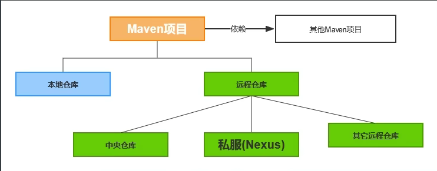

### 自我介绍

面试官您好,我叫**徐孟达**，来自**浙江杭州**，目前**是浙江工业大学**研究生，专业是**软件工程**。目前专注于**Java后端开发**。在过去的 **半年** 中，我主要专注于web应用开发，积累了扎实的技术基础和丰富的项目经验。

我的核心技能包括 **Java、Redis、Spring Boot、MySQL**。此外，我熟悉、**elasticSearch、docker、消息队列**等等。在工作/项目中，我也积累了**基于RABC的权限控制设计**的经验，能够针对实际问题设计高效、稳定的解决方案

？？？

同时还参与了一个电商平台的智能搜索开发，并且选择**基于elasticSearch构建智能搜索模块**。首先，通过设计了**商品索引字段结构**和**配置合适的分词器**和查询分析器，确保了搜索结果的准确性。并且，结合用户行为数据，加入**基于点击量和购买量的热度值**，对搜索结果进行个性化排序，优化用户体验。

### 技术能力

> 技术能力
> • 编程语言: Java ,SQL, Python, Shell
> • 操作系统, 数据库与工程构建: Linux/MySQL/Git/redis/innoDB
> • 框架: SpringBoot/Maven/Mybatis-plus/Mybatis

【Java入职必知必会-26 maven的基本使用】 https://www.bilibili.com/video/BV1ZC411n77H/?share_source=copy_web&vd_source=537aca02ffc6472a2ca091fc13abf60d



### 实习经历

> 2. 独立负责物业模块开发、公告模块: 熟练掌握软件开发总体流程，包括产品原型设计、项目排期、代码开发、前后端联调到项目部署等环节，并熟练掌握 git、idea、apifox、jenkins 和禅道等开发工具的基本功能

一开始的工作，主要是crud，使用easyExcel去做导入导出这类的简单功能，算是了解到真正的企业级开发，并且熟练使用 git、idea、apifox、jenkins 和禅道的基本功能

> 3. 负责审批流开发: 基于 RBAC 框架实现企业入驻审批/资产申领等接口的开发与不同角色的权限配置开发

> 4. 负责构建基于 ElasticSearch 的智能搜索，为电商平台提供快速、精准的商品搜索功能

- 为什么选择ElasticSearch   而不是mysql

  1. 支持**倒排索引**，以**json文档**的形式存储数据，非常适合**全文搜索**，支持模糊查询、高亮、自动补全，如果用mysql一类的去筛选，数据量一旦变大，查询性能就会变差
  2. 分布式架构，后续数据量增多搜索量增多，容易去扩展
  3. 会利用内存缓存部分数据，提升查询性能
  4. 综上，对于搜索这种大量**查询** 需求，选择ElasticSearch 最合理，而solr等类似技术、、 ，mysql作为持久化数据更加合适  

- 倒排索引

  输入一个文字，分词出来的词作为key，整段就作为value；用户搜索某个key就可以查看包含key的文档的score，用户就能得到可能的文档列表，以score去排序的

- Ik分词器 

  - ik_smart
  - 自定义分词规则 
    - 是一个茶产业项目，有许许多多专业名词，需要构建专门的分词字典 分词库
    - 竹溪茶产业 龙峰茶 揉箭 毛尖 饮料

- 索引结构

  ```json
  {
    "product_id": "123456",
    "title": "Apple iPhone 15 Pro Max 手机",
    "description": "最新款苹果手机，支持5G网络，搭载A17芯片，轻薄耐用。",
    "category": "手机数码 > 手机",
    "brand": "Apple",
    "price": 9999.00,
    "stock": 100,
    "status": "在售",
    "seller": {
      "seller_id": "8888",
      "seller_name": "苹果官方旗舰店",
      "seller_rating": 4.9
    },
    "sales": 50000,
    "rating": 4.8,
    "review_count": 20000,
    "tags": ["热卖", "新品", "官方正品"],
    "specifications": {
      "颜色": ["黑色", "银色", "蓝色"],
      "存储容量": ["128GB", "256GB", "512GB"]
    },
    "origin": "中国",
    "warranty": "1年保修",
    "created_at": "2024-09-15T08:00:00Z",
    "updated_at": "2024-12-20T10:00:00Z",
    "s
  
  ```

  ### 这有房园区数字系统 (拱墅国投集团合作项目)

>5. 角色认证: 结合 JWT、Spring Security 以及基于 RABC 的数据库权限表的设计实现无状态的用户认证与权限管理

>6. 系统配置与字典表配置缓存化: 通过 Redis 缓存系统配置和字典表，减少数据库压力，提升系统响应速度

- 为什么选择redis，需求要求并不高，使用简单的hutoo-cache也能满足需求
  - 涉及到成本控制，项目的服务器配置不会特别高
    - 应对数据量的潜在增长
    - 缓存持久化、**支持RDB和AOF日志**，即使 Redis 服务重启，也可以恢复缓存数据，**Hutool-Cache 是基于 JVM 内存的**，服务器一旦重启，所有缓存数据都会丢失，**需要重新加载数据库，增加数据库压力和系统启动时间**。

  - Redis功能更加丰富，未来该项目在不断的版本更新迭代中，可以更平滑的去扩展

- Hash数据结构
- 热点数据加载到redis中，省去每次去数据库访问对数据库造成压力

>7. 财务系统: 企业入驻后的财务模块，支持企业账户的收入管理、流水记录、账单生成及凭证管理功能

>8. 园区资产租赁系统: 园区管理、楼宇管理、租户管理以及物业服务等模块，帮助园区管理者实现全面的信息化管理

### 智慧乡村平台

> 智慧大屏：利用 Redis 缓存复杂聚合结果，设计哈希结构存储大屏各模块数据，缩短查询耗时

> 动态调整定时任务：通过 Spring Boot 的 @Scheduled 与 Nacos 配置监听机制，实时响应配置变更动态调整任务执行逻辑，实现硬件数据采集与同步、村务提醒等定时任务的灵活更新与精准执行。

- **@Scheduled** 

```java
@Schedualed
// Cron cron表达式
// FixdRate  上一次执行开始之后多长时间
// FixdDelay 上一次执行完之后多长时间 
// 技巧：用于测试写好的业务
@EnableSchedual

// 控制 定时任务 的开启 关闭
@ConditionalOnProperty(prefix = "task.scheduler.enable",name = "xxx",havingValue=True) 
```

-  **硬件数据采集与同步**

  - 水质监测

  - 空气质量监测

- **村务提醒**
  - 向村民推送重要事件提醒，如缴纳农保、疫苗接种日期等

