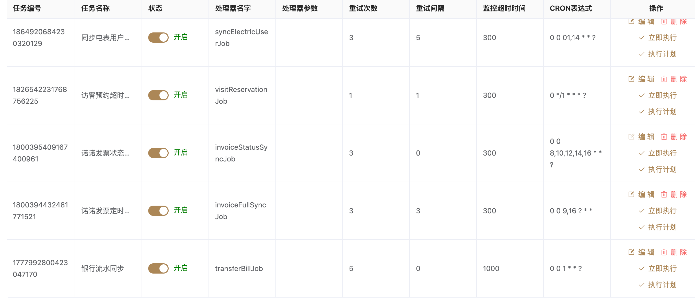

### 1. 自我介绍

面试官您好，我是徐孟达，浙江工业大学软件工程专业硕士在读，应聘Java后端开发岗位。我的优势主要体现在两方面：

**技术能力上**，我通过独立开发技术论坛项目掌握了ElasticSearch实现分布式搜索、Kafka消息队列异步通知等实战经验，同时具备良好的代码规范意识，系统学习过阿里Java开发手册。

**实习方面，**在浙江宇联信息公司大半年的实践中，我深度参与了园区管理系统开发，基于SpringBoot+MySQL架构完成了招商管理、资产调度等核心模块，熟练运用MyBatisPlus进行业务开发。这段经历让我具备了Git协作、API文档对接等企业级开发能力。

以上是我的基本情况，期待能与面试官交流讨论。

#### 工作中遇到的注意问题/遇到的困难

##### 数据库建表 

1. 表必备三字段：`id, create_time, update_time`

2. 用 is_deleted 字段 作为删除依据

3. 表名、字段名必须**使用小写字母或数字**，禁止出现数字开头，禁止两个下划线中间只 出现数字。数据库字段名的修改代价很大，因为无法进行预发布，所以字段名称需要慎重考虑。

4.  如果存储的字符串长度几乎相等，使用 char 定长字符串类型

5. 小数类型为 `decimal`或者`bigdecimal`禁止使用 `float` 和 `double`。

   > 说明：在存储的时候，float 和 double 都存在**精度损失**的问题，很可能在比较值的时候，得到不正确的 结果。如果存储的数据范围超过 decimal 的范围，建议将数据拆成整数和小数并分开存储。

##### 写 Mapper 层 SQL 查询语句的时候

1. 不要使用 select *  影响查询效率
2. 避免使用 % 做匹配，防止加索引会失效

##### 脏数据处理

1. 到生产环境去改数据的时候  先用 select 语句查看要修改或删除的数据，确认无误后在执行，并且要保存修改的 sql 语句

**修改 Bug**

1. 学会看错误日志，经常出现的比如空指针异常，比如第一次正式接收一个模块的时候，和前端联调很顺利，但叫测试之后，后面测试测出来一堆 bug，大部分 bug是情况考虑不够全面，对许多字段缺少校验，有些就会导致空指针异常。
2. Debug 的时候学会查看控制台打印的 sql 语句，比如一句查询语句，测试环境数据库里的数据可能比较少，暂时不满足条件，就会返回空，无法进行后续的逻辑处理，这时候就需要去做判空，返回通知等操作

##### API 接口文档

1. 写好每个入参出参的注释，方便前后端联调
2. token 的使用

##### 具体困难 

租金计算逻辑的优化

1. 从原本的单一计算逻辑改为不同条件下不同的计算方法
2. 使用策略模式将不同的计算逻辑封装成一个类，更具不同的企业类型，自动选择不同的租金计算方式
   - 遇到的困难，主要是从原来代码十分臃肿，计算方法就用一个private方法单独伶出来，入参出参都不方便阅读，花了好久看懂整个逻辑

#### 工作中开发一个模块的流程/业务逻辑

#####  合同签订的业务逻辑

1. 合同模板功能  ------**阿里云OSS**
2. 合同预览 和下载  word 版本  ------**Freemarker** 
3. 合同提交审批 使用审批流   包括合同的撤回、变跟、通过、作废等操作 -----**Spring Security + OAuth2**
4. 最终通过和会生成盖章  ------**第三方e签宝**

##### 华云科技复盘的问题

1. Kafka 消息队列性能问题
   1. 

### 2. 以下技术栈的基础问题

> 技术能力
> • 编程语言: Java ,SQL, Python, Shell
> • 操作系统, 数据库与工程构建: Linux/MySQL/Git/redis/innoDB
> • 框架: SpringBoot/Maven/Mybatis-plus/Mybatis

【Java入职必知必会-26 maven的基本使用】 https://www.bilibili.com/video/BV1ZC411n77H/?share_source=copy_web&vd_source=537aca02ffc6472a2ca091fc13abf60d


mvn 中央仓库 https://mvnrepository.com/

解决依赖冲突

1. 查看依赖冲突
   1. maven helper 插件
   2. mvn -Dverbose dependency:tree

- 路径最短优先原则

  - 根据依赖路径的长度来选择决定选择哪个依赖

- 最先声明

- 排除依赖

- 封装成 rpc 服务


> 编程语言: Java(熟悉集合、多线程、JVM 基础),SQL, Python, Shell 
> 框架工具: SpringBoot/ Spring Security/Mybatis-plus/Mybatis/Kafka
> 中间件: Kafka/ElasticSearch
> 数据库: MySQL/Oracle/redis
> 开发工具: git、idea、apifox、jenkins 、禅道

以下是你的技术栈中常见的基础面试问题，并给出一些示例，以便你可以更口语化地应对面试官的提问。

---

#### **编程语言**
##### **Java**
| **问题**                 | **示例回答**                                                 |
| ------------------------ | ------------------------------------------------------------ |
| **多线程如何创建？**     | "Java 里创建线程有 3 种方式：继承 `Thread` 类、实现 `Runnable` 接口、使用 `Callable` 和 `FutureTask`。比如实现 `Runnable` 方式更好，因为它不受 Java 单继承的限制。" |
| **多线程如何保证安全？** | "可以用 `synchronized`、`Lock`、`Atomic` 类来保证线程安全。例如，`synchronized` 用来锁住代码块或者方法，防止多个线程同时访问共享资源。" |
| **JVM 内存模型有哪些？** | "JVM 主要有堆、栈、方法区、程序计数器和本地方法栈。比如，堆是存放对象的，栈存放方法调用时的局部变量，而方法区存的是类信息、运行时常量池等。" |

##### **SQL**
| **问题**                         | **示例回答**                                                 |
| -------------------------------- | ------------------------------------------------------------ |
| **SQL 优化有哪些方法？**         | "可以用索引、避免 `select *`、分库分表、缓存、调整 SQL 语句结构等。例如，在 `where` 条件中使用索引列可以加快查询速度，像 `EXPLAIN` 可以分析 SQL 执行计划。" |
| **事务的四大特性？**             | "ACID，分别是原子性、一致性、隔离性、持久性。比如，银行转账时，要么钱完全转走，要么完全不转，这就是原子性。" |
| **MySQL 和 Oracle 有什么区别？** | "MySQL 适合中小型应用，性能高，免费；Oracle 更适合大规模企业应用，事务处理能力更强，提供更好的高可用性方案。" |

##### **Python / Shell**
| **问题**                    | **示例回答**                                                 |
| --------------------------- | ------------------------------------------------------------ |
| **Python 和 Java 的区别？** | "Python 更简洁，主要用于数据分析、机器学习，解释型语言；Java 是强类型语言，编译后执行，适用于大规模企业应用。" |
| **Shell 脚本如何执行？**    | "直接用 `sh script.sh` 或者 `./script.sh` 运行。不过 `./script.sh` 之前要 `chmod +x script.sh` 赋予执行权限。" |

---

#### **框架工具**
##### **SpringBoot**
| **问题**                          | **示例回答**                                                 |
| --------------------------------- | ------------------------------------------------------------ |
| **SpringBoot 和 Spring 的区别？** | "SpringBoot 是 Spring 的升级版，它能自动配置，不需要写一堆 XML 配置，开发更快，比如 `@SpringBootApplication` 就能启动项目。" |
| **SpringBoot 如何管理 Bean？**    | "SpringBoot 通过 `@ComponentScan` 和 `@Bean` 来管理 Bean，`@Autowired` 用来注入 Bean。" |
| **SpringBoot 你常用的注解**       |                                                              |

##### **Spring Security**
| **问题**                        | **示例回答**                                                 |
| ------------------------------- | ------------------------------------------------------------ |
| **Spring Security 认证流程？**  | "Spring Security 主要是通过 `UsernamePasswordAuthenticationToken` 进行认证的，它有过滤器链，比如 `AuthenticationFilter`，最终交给 `SecurityContextHolder` 处理。" |
| **如何使用 JWT 进行身份认证？** | "JWT 是无状态的 Token 认证机制，比如用户登录后返回一个 JWT，后续请求带上 JWT，服务端解析 JWT 获取用户信息。" |

##### **MyBatis / MyBatis-Plus**
| **问题**                             | **示例回答**                                                 |
| ------------------------------------ | ------------------------------------------------------------ |
| **MyBatis 和 MyBatis-Plus 的区别？** | "MyBatis 需要手写 SQL，MyBatis-Plus 提供了 CRUD 方法，简化开发，比如 `selectById()` 直接查数据库，不用写 SQL 语句。" |
| **MyBatis 如何防止 SQL 注入？**      | "使用 `#{}` 方式传参数，避免 `statement` 直接拼接字符串，比如 `select * from user where name = #{name}` 是安全的。" |
| MyBatis-Plus 分页                    | **先配置分页插件**：在 `MyBatisPlusConfig` 中注册 `PaginationInnerInterceptor`，确保分页功能可用。 **在 `Mapper` 层使用 `Page<T>`：**  继承 `BaseMapper<T>`，直接使用 `selectPage` 方法实现分页查询。 需要自定义 SQL 时，手动传入 `Page<T>`，并使用 `LIMIT` 进行分页。 **在 `Service` 层处理业务逻辑：**  接收 **当前页、每页大小、筛选条件**，创建 `Page<T>` 对象，调用 `Mapper` 层方法进行查询。 **在 `Controller` 层提供分页 API：**  让前端传递分页参数（`page`、`size`、筛选条件），返回 `IPage<T>` 结构的数据。 |


---

#### **中间件**
##### **Kafka**
| **问题**                       | **示例回答**                                                 |
| ------------------------------ | ------------------------------------------------------------ |
| **Kafka 怎么保证消息不丢失？** | "Kafka 通过 `acks=all` 配置可以确保所有副本都收到消息才返回成功，同时 `replication-factor` 也能保证高可用。" |
| **Kafka 如何处理消息重复？**   | "可以用幂等生产者（`enable.idempotence=true`）和去重逻辑，比如给每条消息加一个唯一 ID，消费时去重。" |

##### **ElasticSearch**
| **问题**                 | **示例回答**                                                 |
| ------------------------ | ------------------------------------------------------------ |
| **ES 和 MySQL 的区别？** | "ES 是搜索引擎，适合全文检索，查询快；MySQL 是关系型数据库，适合事务处理，比如用户数据管理。" |
| **ES 如何优化查询？**    | "可以用 `index` 分片，`filter` 代替 `query`，减少 `score` 计算，提高查询速度。" |

---

#### **数据库**
##### **MySQL / Oracle / Redis**
| **问题**                      | **示例回答**                                                 |
| ----------------------------- | ------------------------------------------------------------ |
| **MySQL 的索引有哪些？**      | "常见的有 B+ 树索引、哈希索引、全文索引。B+ 树索引是 MySQL 默认索引，适合范围查询。" |
| **Redis 为什么比 MySQL 快？** | "Redis 是基于内存的，数据存储在 RAM 里，而 MySQL 是磁盘存储，所以 Redis 读写更快。" |
| **Redis 的数据结构有哪些？**  | "有 5 种：`String`、`List`、`Set`、`Hash`、`ZSet`。比如 `String` 可以存用户 token，`ZSet` 用来做排行榜。" |

---

#### **开发工具**
##### **Git**
| **问题**                 | **示例回答**                                                 |
| ------------------------ | ------------------------------------------------------------ |
| **Git 合并分支的方式？** | "主要有 `merge` 和 `rebase`，`merge` 会产生合并提交，`rebase` 会把提交放到最新的 `HEAD` 后。" |
| **如何撤销 Git 提交？**  | "如果只是撤销 `commit`，可以 `git reset --soft HEAD~1`，如果要丢弃改动，用 `git reset --hard HEAD~1`。" |

##### **Jenkins**
| **问题**                   | **示例回答**                                                 |
| -------------------------- | ------------------------------------------------------------ |
| **Jenkins 怎么做 CI/CD？** | "Jenkins 通过 `Pipeline` 进行自动构建、测试和部署，比如 `Jenkinsfile` 里定义 `build`、`test`、`deploy` 阶段。" |

##### **Apifox / 禅道**
| **问题**                  | **示例回答**                                                 |
| ------------------------- | ------------------------------------------------------------ |
| **Apifox 的作用是什么？** | "它是 API 测试工具，可以快速调试接口，模拟请求，类似 Postman，但支持更好的团队协作。" |
| **禅道用于做什么？**      | "它是项目管理工具，特别适合管理 Bug、需求和任务，比如在敏捷开发里用来跟踪迭代进度。" |

---

##### **总结**
面试时，面试官不会问太过深奥的东西，而是希望你能清楚地解释基础知识并结合实际经验。建议：
1. **用简单易懂的语言表达**，避免死记硬背概念，而是用自己的话总结。
2. **结合项目经验**，比如 “在 XX 项目里，我用 Redis 做缓存，把热点数据存 Redis，减少数据库访问，提高性能”。
3. **适当举例**，比如 “MyBatis 防 SQL 注入，比如 `#{param}` 这种用法可以避免拼接 SQL 带来的问题”。

如果有某些问题想深入了解，欢迎随时问！


### 3. **功能开发**    印象最深的功能

#### 1. 实习-节假日排班

1. 产品经理沟通  了解好需求 根据具体节假日增加排期、查看排期、删除排期
2. 设计表  节假日表   节假日排期详情表
3. 利用代码生成工具  创建好 实体类 mvc 类
4. 和前端对好输入输出之后 开始写后端代码
5.  写好 sql 语句 、涉及到多表联查 mapper 层，利用 mabatis 在 java 中调用
6. 在service 层调用 mapper 层的数据接口 ，创建 DTO 类 做一些必要的数据类型转换 比如日期的转换  字典项的转换 也是比如涉及到园区 id 的  ，调园区业务层的接口，转换成园区名字
7. 业务层   做一些必要的校验，比如该节假日排期是否已存在 等等
8. control 层 一 就是开放前端请求  二就是入参用注解 @validate 去做一些基本的校验

#### 2. 什么是RBAC

后面难度大一点的工作，一个是负责了企业入驻审批流的后端开发，主要是先学习了**角色的访问控制** 就是RBAC 的数据库建表的思想框架，学习用户角色权限表之间的关联，学习了**基于 flowable** 如何搭建一个审批流程，最终独立实现了现有企业入驻审批框架的改进并成功验收

另一个是参与了一个电商平台的智能搜索开发，并且选择**基于elasticSearch构建智能搜索模块**。首先，通过设计了**商品索引字段结构**和**配置合适的分词器**和查询分析器，确保了搜索结果的准确性。并且，结合用户行为数据，加入**基于点击量和购买量的热度值**，对搜索结果进行个性化排序，优化用户体验。

#### 3.  Redis 与 Caffine 做缓存 

1. 哪些数据需要做缓存？  访问量大，但是不需要经常修改的
   1. 论坛项目中  热门的帖子 
   2. 园区项目， 访客预约二维码 设置短过期时间
   3. 字典项、配置、权限信息
   4. 用户权限信息 用户 session 
      1. 往往实际业务会涉及到复杂的权限管理
      2. 用户访问某个接口时，往往需要验证用户是否有权限访问该接口，访问次数越来越多，会对数据库造成压力，导致调用变慢，用户体验不好

2. 如何缓存
   1. **查询数据时，优先从 Caffeine 获取**。
   2. **如果 Caffeine 没有，则查询 Redis**，并回填到本地缓存。
   3. **如果 Redis 也没有，则查询数据库**，然后同步到 Redis 和 Caffeine
3. 为什么选择 Redis 和 Caffine
   1. Caffine 作为本地缓存的其中一种，相比于 Guava 更加适合当时的项目，单机性能最好，不涉及网络开销
   2. Redis 没有本地缓存速度快，但他可以单独部署，提供给其他服务器访问能力即可实现分布式缓存，可以保证多服务器之间数据的一致性，避免Caffine 的局限性

缓存最佳的实现方法

- **短期热点数据用 Caffeine**，**跨服务器共享数据用 Redis**，**长期数据用数据库**。

这样可以**最大限度提高查询速度，减少数据库和 Redis 的压力，提高系统稳定性**。

### 实习经历

> 2. 独立负责物业模块开发、公告模块: 熟练掌握软件开发总体流程，包括产品原型设计、项目排期、代码开发、前后端联调到项目部署等环节，并熟练掌握 git、idea、apifox、jenkins 和禅道等开发工具的基本功能

一开始的工作，主要是实现一些增删改查的功能，以及使用easyExcel去做导入导出这类的简单功能，算是了解到真正的企业级开发，并且熟练使用 git、idea、apifox、jenkins 和禅道的基本功能

> 3. 负责审批流开发: 基于 RBAC 框架实现企业入驻审批/资产申领等接口的开发与不同角色的权限配置开发

#### 设计企业入驻审批

1. 园区一线人员 收集企业入驻必要信息

   1. 企业信息 比方说 入驻  **位置**  入驻**面积** 入驻**周期** 
      2. *一线人员可以暂存 撤回 废除 不涉及审批流程

   - 操作：暂存
     - 数据不会进入审批流，仅保存至自定义的业务表。
   - 操作：提交
     - `ACT_RU_TASK` 表新增一条任务记录（任务类型为用户任务）。
     - `ACT_RU_EXECUTION` 表新增一条流程实例记录。
     - 流程变量（如位置、面积、周期）存储到 `ACT_RU_VARIABLE` 表中

2. 提交给入驻园区负责人 审批该合同 

   1. 材料通过  审核状态改变为 
   2. 是否需要修改  
      1. 面积超出剩余使用面积，会出现提示
      2. 入驻位置已被占用
      3. 入驻周期少于 1 年也会
   3. 是否废除
   4. 暂存 不涉及审批流程

   - - 当前任务状态从 `ACT_RU_TASK` 表移至 `ACT_HI_TASKINST` 表。
     - 流程实例继续执行，生成下一任务节点的记录。
   - 操作：修改
     - 流程变量（如位置、面积）更新到 `ACT_RU_VARIABLE` 表中。
   - 操作：废除
     - 流程结束，实例记录从 `ACT_RU_EXECUTION` 表移至 `ACT_HI_PROCINST` 表。

3. 园区一线人员审核

   1. 根据合同金额、占用面积、不同位置 生成多级审批流
   2. 金额大于某个自定义的数，比如说 超过100w 时 需要走两级审批

   - 操作：两级审批
     - 根据金额条件动态生成两级审批任务，`ACT_RU_TASK` 表中生成两条任务记录。
   - 操作：单级审批
     - 只生成一条任务记录。

4. 最后提交 OA 系统，国投原始系统自带的 api

   1. 测试通过调用系统接口

   - 流程结束，所有运行时表（如 `ACT_RU_TASK` 和 `ACT_RU_EXECUTION`）记录转移至历史表。
   - 接口返回结果记录到 `ACT_HI_VARINST` 表中，存储 OA 系统的响应信息

后面有个审批流开发的工作，主要是学习了**基于角色的访问控制** RBAC 框架，以及通过 springSecurity 和 JWT 去实现审批管理界面的访问

- 数据库设计

  RBAC 设计 

  - 用户表
  - 角色表
  - 用户角色表 该用户为什么什么角色
  - 权限表
  - 角色权限表 该角色有什么什么权限

  审批相关表

  - 审批记录表

    - 审批流程模板表

      - 审批规则`approval_processes`

      ```
      id (主键): 审批流程模板的唯一标识
      name: 流程名称，例如“企业入驻审批”或“合同审批”
      max_level: 流程的最大层级数（如 3 层主管审批）
      create_by: 创建模板的管理员
      created_at: 模板创建时间
      ```

    - 审批层级对应角色表`approval_level_roles`

      - | 字段名             | 类型      | 描述                                                         |
        | ------------------ | --------- | ------------------------------------------------------------ |
        | `id`               | BIGINT    | 主键，自增 ID                                                |
        | `process_id`       | BIGINT    | 审批流程 ID（外键，关联审批流程表 `approval_processes`）     |
        | `level_id`         | BIGINT    | 审批层级 ID（外键，关联审批层级表 `approval_process_levels`） |
        | `role_id`          | BIGINT    | 审批角色 ID（外键，关联角色表）                              |
        | `approver_user_id` | BIGINT    | 审批人用户 ID（可选，覆盖角色直接指定审批人）                |
        | `priority`         | INT       | 审批角色的优先级（用于支持多个角色审批）                     |
        | `created_at`       | TIMESTAMP | 创建时间                                                     |
        | `updated_at`       | TIMESTAMP | 更新时间                                                     |

    - 审批记录

      - 某个合同审批的当前状态

      ```
      id (主键): 审批记录的唯一标识
      process_id: 审批流程模板 ID，关联 `approval_processes`
      reference_id: 被审批对象的 ID，例如企业入驻申请 ID 或合同 ID
      
      level: 当前审批的层级，从 1 开始递增
      status: 审批状态（PENDING/APPROVED/REJECTED）
      comments: 审批意见（如“已通过，符合标准”）
      created_at: 审批记录创建时间
      updated_at: 审批状态更新时间
      ```

    - 审批操作日志表

      - 审批操作日志

      ```
      id (主键): 审批日志的唯一标识
      approval_id: 关联的审批记录 ID
      action: 操作类型（如 SUBMIT、APPROVE、REJECT）
      approver_id: 审批人的用户 ID
      approver_role: 审批人的角色，例如 "主管"、"财务人员"
      actor_id: 操作人用户 ID
      action_time: 操作时间
      remarks: 备注信息（如“合同金额大，需要上报”）
      ```

  - **审批流程模板表**负责定义审批流程的全局规则和层级结构。

  - **审批层级对应角色表**负责为每层审批指定审批人或角色，并支持动态条件。

  - **审批记录表**跟踪审批流程的执行状态，从提交到完成。

  - **审批操作日志表**详细记录每一次审批操作，用于审计和溯源。

- 审批流程设计

  - 企业入驻审批

    审批状态

    1. 待处理
    2. 审核通过
    3. 驳回
    4. 完成
    5. 已撤回
    6. 超时

  - 审批场景

    - **提醒待处理审批** @schedule 注解实现
      - 将审批记录表中所有待处理的审批通知到对应审批人
    - 当前层级审批完成后，系统将自动创建下一层级的 **PENDING** 状态记录，等待下一位审批人操作

  - 总体流程

    审批通过后调到下一级审批的方法，审批驳回后的方法

    管理端：

    用户提交审批时，根据审批条件生成不同的审批流（如金额、类型等的条件控制），对**审核状态的管理**，**超时的方法**，审核人员 **通过**或**驳回**或**延期**后的状态**更新方法**以及**跳到下一级审批**的方法

    - 动态审批层级判断。根据审批条件生成不同的审批流（如金额、类型等的条件控制）
      - 状态管理 审批有什么状态 待 xxx 审批中 xxx 退回 xxx 已通过
      - 状态更新方法 
      - 审批超时方法 自动回退
      - 自动跳到下一级审批的方法
    - 创建和管理审批模板
      - 配置审核条件
      - 配置审核人

    审核人 

    - 审批通过 、 驳回 、 转交（驳回理由）

    - 查询审批记录

    用户端

    - 

    - 生成审批实例并且初始化

> 4. 负责构建基于 ElasticSearch 的智能搜索，为电商平台提供快速、精准的商品搜索功能

#### El

- 为什么选择ElasticSearch   而不是mysql

  1. 支持**倒排索引**，以**json文档**的形式存储数据，非常适合**全文搜索**，支持模糊查询、高亮、自动补全，如果用mysql一类的去筛选，数据量一旦变大，查询性能就会变差
  2. 分布式架构，后续数据量增多搜索量增多，容易去扩展
  3. 会利用内存缓存部分数据，提升查询性能
  4. 综上，对于搜索这种大量**查询** 需求，选择ElasticSearch 最合理，而solr等类似技术、、 ，mysql作为持久化数据更加合适  

- 倒排索引

  输入一个文字，分词出来的词作为key，整段就作为value；用户搜索某个key就可以查看包含key的文档的score，用户就能得到可能的文档列表，以score去排序的

- Ik分词器 

  - ik_smart
  - 自定义分词规则 
    - 是一个茶产业项目，有许许多多专业名词，需要构建专门的分词字典 分词库
    - 竹溪茶产业 龙峰茶 揉箭 毛尖 饮料

- 索引结构

  ```json
  {
    "product_id": "123456",
    "title": "Apple iPhone 15 Pro Max 手机",
    "description": "最新款苹果手机，支持5G网络，搭载A17芯片，轻薄耐用。",
    "category": "手机数码 > 手机",
    "brand": "Apple",
    "price": 9999.00,
    "stock": 100,
    "status": "在售",
    "seller": {
      "seller_id": "8888",
      "seller_name": "苹果官方旗舰店",
      "seller_rating": 4.9
    },
    "sales": 50000,
    "rating": 4.8,
    "review_count": 20000,
    "tags": ["热卖", "新品", "官方正品"],
    "specifications": {
      "颜色": ["黑色", "银色", "蓝色"],
      "存储容量": ["128GB", "256GB", "512GB"]
    },
    "origin": "中国",
    "warranty": "1年保修",
    "created_at": "2024-09-15T08:00:00Z",
    "updated_at": "2024-12-20T10:00:00Z",
    "s
  
  ```

  ### 这有房园区数字系统 (拱墅国投集团合作项目)

>5. 角色认证: 结合 JWT、Spring Security 以及基于 RABC 的数据库权限表的设计实现无状态的用户认证与权限管理

SpringSecurity+jwt实现权限认证功能 详情如下

https://blog.csdn.net/qq_45440103/article/details/143820160

jwt 相当于校园卡

>6. 系统配置与字典表配置缓存化: 通过 Redis 缓存系统配置和字典表，减少数据库压力，提升系统响应速度

- 系统配置比如说 **接口超时时间，最大用户数量，系统版本**这些配置一般是系统启动时读取一次，且不太会频繁变化，如果把这些数据利用 redis 存到缓存中，可以避免频繁访问数据库，减少数据库的负载

#### Redis

- 为什么选择redis，需求要求并不高，使用简单的hutoo-cache也能满足需求
  - 涉及到成本控制，项目的服务器配置不会特别高
    - 应对数据量的潜在增长
    - 缓存持久化、**支持RDB和AOF日志**，即使 Redis 服务重启，也可以恢复缓存数据，**Hutool-Cache 是基于 JVM 内存的**，服务器一旦重启，所有缓存数据都会丢失，**需要重新加载数据库，增加数据库压力和系统启动时间**。

  - Redis功能更加丰富，未来该项目在不断的版本更新迭代中，可以更平滑的去扩展

  - Redis 内部做了非常多的性能优化，比较重要的有下面 3 点：
    1. Redis **基于内存**，内存的访问速度比磁盘快很多；
    2. Redis 基于 Reactor 模式设计开发了一套高效的事件处理模型，主要是**单线程事件循环和 IO 多路复用**（Redis 线程模式后面会详细介绍到）；
    3. Redis 内置了多种优化过后的**数据类型/结构**实现，性能非常高。
    4. Redis 通信协议实现简单且解析高效。

- Hash数据结构
- 热点数据加载到redis中，省去每次去数据库访问对数据库造成压力

>7. 财务系统: 企业入驻后的财务模块，支持企业账户的收入管理、流水记录、账单生成及凭证管理功能

>8. 园区资产租赁系统: 园区管理、楼宇管理、租户管理以及物业服务等模块，帮助园区管理者实现全面的信息化管理

### 智慧乡村平台

> 智慧大屏：利用 Redis 缓存复杂聚合结果，设计哈希结构存储大屏各模块数据，缩短查询耗时

> 动态调整定时任务：通过 Spring Task 与 Nacos 配置监听机制，实时响应配置变更动态调整任务执行 逻辑，实现硬件数据采集与同步、村务提醒等定时任务的灵活更新与精准执行。

直接通过 Spring 提供的 `@Scheduled` 注解即可定义定时任务

1. **线程池调度**：
   - Spring Task 内置了一个默认的调度器，基于线程池（通常是 `ScheduledThreadPoolExecutor`）来执行定时任务。
   - 如果需要并发控制，可以通过自定义配置线程池，避免任务堆积或执行冲突。
2. **任务触发器（Trigger）**：
   - 支持基于 **Cron 表达式**（如 `@Scheduled(cron = "0 0/5 * * * ?")`）来定义任务的具体触发时间。
   - 也可以基于固定时间间隔（`fixedRate` 或 `fixedDelay`）来循环执行任务。
3. **任务注册与执行**：
   - 当 Spring Boot 项目启动时，`@Scheduled` 注解的方法会被自动扫描并注册到调度器中。
   - 调度器负责根据触发器规则定时调用对应的方法，执行任务。

http://cron.qqe2.com/ 

- **@Scheduled** 

```java
@Schedualed
// Cron cron表达式
// FixdRate  上一次执行开始之后多长时间
// FixdDelay 上一次执行完之后多长时间 
// 技巧：用于测试写好的业务
@EnableSchedual

// 控制 定时任务 的开启 关闭
@ConditionalOnProperty(prefix = "task.scheduler.enable",name = "xxx",havingValue=True) 
```



-  **硬件数据采集与同步**
  - 水质监测

  - 空气质量监测

-  **村务提醒**
  - 向村民推送重要事件提醒，如缴纳农保、疫苗接种日期等

